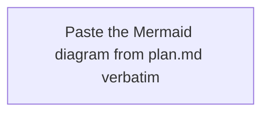

### Goal (from `plan.md`)

[High-level goal of the diff, as stated in the plan]

### Diagram (from `plan.md`)

```mermaid
flowchart TD
  PlanDiagram[Paste the Mermaid diagram from plan.md verbatim]
```

### Plan

See `plan.md`.
