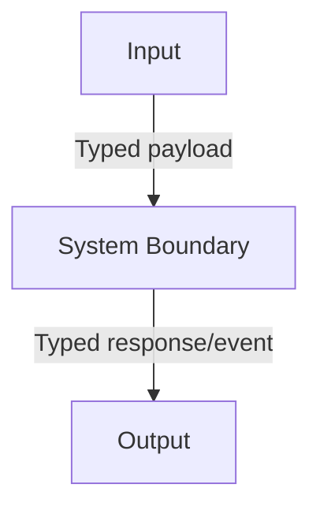

# Plan Title

## Metadata

- Plan type: `plan` | `sub-plan`

## System Intent

- What this is:
- Primary consumer(s):
- Boundary (black-box scope only):

## Mermaid Diagram

> Use the `create-mermaid-diagram` skill to generate this diagram.



## Flows

### Flow: `exampleFlow`
- Test files: `tests/test_example.py`
- Core files: `src/example.py`

#### Types

```txt
ExampleInput {
  id: string (required)
}

ExampleOutput {
  result: string (description)
}

StandardError {
  status: number (HTTP status)
  code: string (stable machine-readable code)
  message: string (human-readable summary)
}
```

#### Paths

| path | input | output | path-type | notes |
| --- | --- | --- | --- | --- |
| `exampleFlow.success` | `ExampleInput` | `ExampleOutput` | `happy path` | |
| `exampleFlow.not-found` | `ExampleInput` | `StandardError status=404` | `error` | |

#### Pseudocode

> Only include if this flow has non-obvious implementation details worth preserving.

```
omit this section if not needed
```

## Logs

| Source | Location |
|--------|----------|
| example | `CloudWatch: /aws/lambda/example` |

## Deployment

- Mechanism: `SAM` | `docker` | `Lambda direct` | `local only` | other
- Deploy command:
  ```bash
  # command here
  ```
- Notes:
