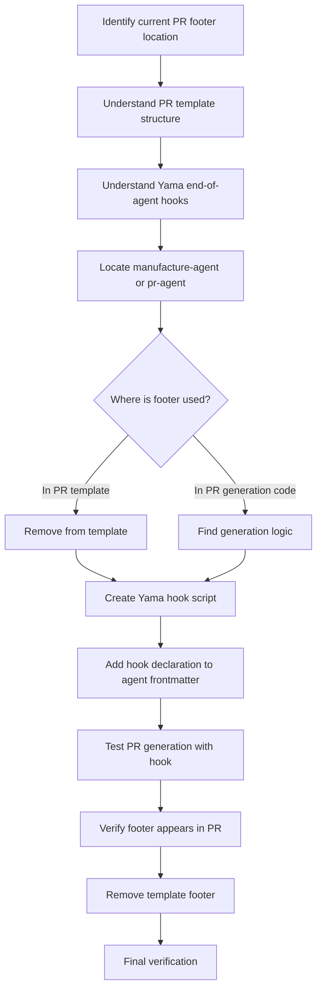

# Plan: Move "Made with dark-factory" PR Footer from Template to Yama End-of-Agent Hook

## System Intent

Currently, the "Made with dark-factory" footer is hardcoded into the PR template. This task moves that footer from being a static template element to a dynamic Yama end-of-agent hook, ensuring it's automatically appended to PR descriptions by the manufacturing agent (manufacture-agent) when it completes.

The benefits of this approach:
- PR footer is now generated dynamically rather than being a static template
- Footer can be customized more easily without touching template files
- Separation of concerns: template vs. generated content
- Follows dark-factory's existing hook-based architecture pattern

## Mermaid Diagram

## Flow: Discovery Phase

### Objective
Locate the current "Made with dark-factory" footer and understand how it's currently integrated into the PR creation process.

### Steps

1. Search for "Made with dark-factory" in the codebase to identify:
   - Where it appears (template files, PR description generation code)
   - Current location and implementation
   - Any existing PR generation mechanisms

2. Identify the PR generation agent(s):
   - Find which agent(s) handle PR creation and description building
   - Look for manufacture-agent, pr-agent, or similar
   - Understand current PR description assembly logic

3. Research Yama end-of-agent hooks:
   - Understand how Yama hooks work in this context
   - Identify existing examples of end-of-agent hooks
   - Determine hook naming and registration patterns

4. Document findings:
   - Current footer location and implementation
   - Which agent should own the footer hook
   - Proposed hook placement and mechanism

### Expected Output
- Clear understanding of current footer implementation
- Identified agents responsible for PR creation
- Hook integration strategy documented

## Flow: Implementation Phase

### Objective
Move the PR footer from static template to dynamic Yama end-of-agent hook.

### Steps

1. Create the Yama hook script:
   - Create a new hook script that appends "Made with dark-factory" to PR description
   - Script should integrate with Yama's end-of-agent hook system
   - Ensure proper formatting and styling

2. Add hook to agent frontmatter:
   - Identify the correct agent (likely manufacture-agent)
   - Add Yama hook declaration to agent's `.md` file
   - Follow existing hook declaration patterns

3. Remove footer from template:
   - Locate PR template file(s)
   - Remove "Made with dark-factory" footer text
   - Ensure template is still valid after removal

4. Test the integration:
   - Verify hook is properly registered
   - Test PR generation with hook in place
   - Confirm footer appears correctly in generated PRs

### Expected Output
- Yama hook script created and functional
- Agent frontmatter updated with hook declaration
- PR template updated (footer removed)
- PRs now include footer via hook

## Flow: Verification Phase

### Objective
Verify the footer migration is complete and working correctly.

### Steps

1. Verify hook registration:
   - Check that hook is properly declared in agent frontmatter
   - Confirm hook appears in settings.json after plugin reload
   - Validate hook script syntax

2. Test PR generation:
   - Create a test PR using the manufacturing agent
   - Verify footer appears in PR description
   - Check formatting and placement

3. Verify template cleanup:
   - Confirm footer removed from PR template
   - Ensure template is still valid
   - Check no duplicate footers appear

4. Final validation:
   - Run through complete PR creation workflow
   - Verify no regressions
   - Check hook runs at correct time (end-of-agent)

### Expected Output
- Hook working correctly with manufacture-agent
- PR footer appears dynamically in generated PRs
- No duplicate footers from old template
- All tests passing

## Stage Gate Tracker

- [ ] Stage 1: System Intent approved
- [ ] Stage 2: Mermaid Diagram approved
- [ ] Stage 3: Discovery Flow approved
- [ ] Stage 4: Implementation Flow approved
- [ ] Stage 5: Verification Flow approved
- [ ] Ready for Execution
