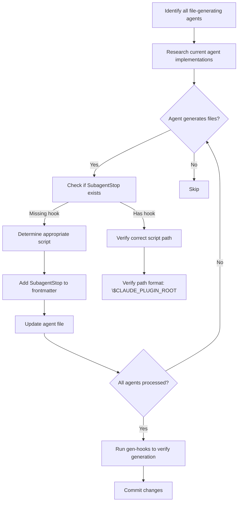

# Plan: Add SubagentStop Hooks to File-Generating Agents

## System Intent

Update all agents in dark_factory that generate files to declare a `SubagentStop` hook in their YAML frontmatter. This ensures that file-generating agents can properly commit generated artifacts when they complete, following the pattern established in `dark-factory:subagent-stop-in-agent-frontmatter` skill documentation.

The hook declarations should be embedded in each agent's own `.md` file (not in hooks.json), making it clear which agents trigger which hooks. Agents that generate files include:
- Execution phase agents (skeleton-agent, testing-agent, implementation-agent)
- Documentation agents (investigation-agent, claim-validator-agent)
- Planning agents (planning-agent, diagram-rendering agents)
- Other agents that write files (pr-agent, etc.)

## Mermaid Diagram

## Flow: Research Phase

### Objective
Identify all agents that generate files and determine which need SubagentStop hooks added.

### Steps

1. Search the codebase for all agent `.md` files in:
   - `agents/featurework/execution/agents/`
   - `agents/featurework/planning/`
   - `agents/commands/`
   - `agents/dark-factory/`

2. For each agent file, determine:
   - Does the agent description mention creating, writing, or generating files?
   - Are there Write, Edit, or glob tool mentions in the frontmatter?
   - Does the agent already have a SubagentStop hook?
   - What is the agent's primary purpose (file generation)?

3. Create a comprehensive list of agents that need updates:
   - Current status (has hook or needs hook)
   - Hook script they should use
   - Any special considerations

### Expected Output
- `agents_needing_hooks.md` - List of all file-generating agents and their hook status
- Understanding of which hook scripts are appropriate for each agent

## Flow: Implementation Phase

### Objective
Add SubagentStop hook declarations to all identified file-generating agents.

### Steps

1. For each agent that generates files and lacks a SubagentStop hook:
   - Open the agent's `.md` file
   - Add the appropriate SubagentStop line to YAML frontmatter
   - Use absolute path: `${CLAUDE_PLUGIN_ROOT}/agents/dark-factory/scripts/<script-name>`
   - Verify YAML syntax is correct

2. Hook script selection logic:
   - **Execution agents** (skeleton, testing, implementation): Use `commit-on-subagent-stop.sh`
   - **Investigation agents** (investigation-agent, investigation-orchestrator): Use `commit-investigation-docs.sh`
   - **Documentation agents**: Determine if they need existing script or create new one
   - **Planning agents**: Determine if they need SubagentStop at all

3. Verify each change:
   - Frontmatter YAML parses correctly
   - Hook path format is correct
   - No duplicate declarations

### Core Files to Modify
- `agents/featurework/execution/agents/skeleton-agent.md` (verify existing)
- `agents/featurework/execution/agents/testing-agent.md` (verify existing)
- `agents/featurework/execution/agents/implementation-agent.md` (verify existing)
- `agents/commands/investigation-orchestrator.md` (verify existing)
- `agents/commands/investigation-agent.md` (if exists and generates files)
- `agents/commands/claim-validator-agent.md` (if exists and generates files)
- Other file-generating agents identified in research phase

## Flow: Verification Phase

### Objective
Verify that SubagentStop hooks are properly declared and will be generated correctly.

### Steps

1. Run `/dark-factory:gen-hooks` to regenerate `.claude/settings.json`
2. Verify that all SubagentStop entries appear in `settings.json` with correct paths
3. Check that hook scripts referenced actually exist:
   - `agents/dark-factory/scripts/commit-on-subagent-stop.sh`
   - `agents/dark-factory/scripts/commit-investigation-docs.sh`
4. Reinstall the plugin with `/dark-factory:install`
5. Verify plugin loads without errors

### Expected Output
- All hooks properly generated in `.claude/settings.json`
- Plugin reinstalls successfully
- No missing script errors

## Stage Gate Tracker

- [x] Stage 1: System Intent approved
- [x] Stage 2: Mermaid Diagram approved
- [x] Stage 3: Research Flow approved
- [x] Stage 4: Implementation Flow approved
- [x] Stage 5: Verification Flow approved
- [x] Ready for Execution
