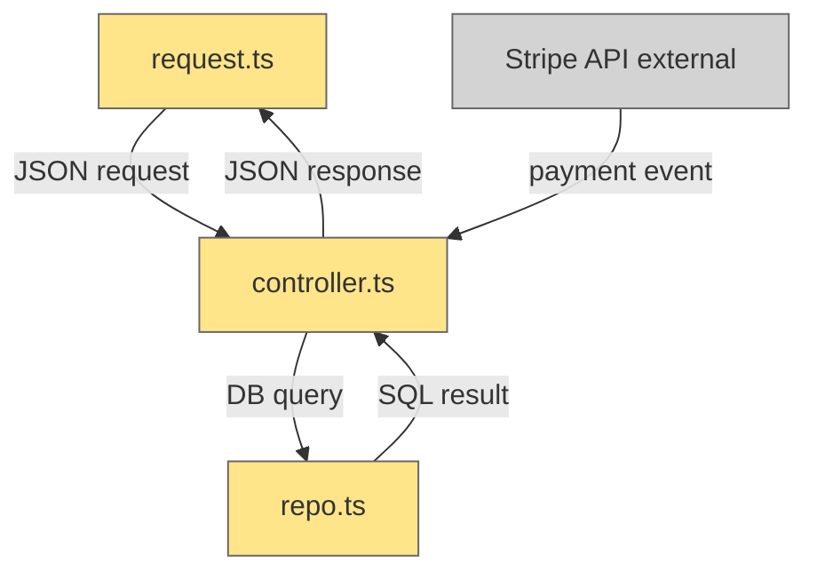

## Required

You must use this skill whenever you add a Mermaid diagram for a code change.

1. **Scope The Architecture**: Include enough nodes to explain the system context for the change, but treat external APIs or black-box services as single nodes.
2. **Encode Change State**: Color nodes by file status.
   - Gray: no changes
   - Yellow: updated file
   - Red: deleted file
   - Green: new file
3. **Label Nodes Precisely**: Each node label must include a descriptive name and a controlled path reference to code (source file or code directory path).
   - **Syntax guard**: Avoid raw parentheses in Mermaid node labels (they can be parsed as node shapes). Use separators like `handler.ts — api/handlers/handler.ts` or `handler.ts | api/handlers/handler.ts`, and avoid illegal characters for Mermaid labels.
   - If a real file path contains Mermaid-reserved characters like `(`, `)`, `[`, or `]`, replace them in the label with safe tokens (e.g., `(tabs)` -> `tabs`, `[eventId]` -> `eventId`) and add a short note outside the diagram stating the actual path.
   - **Infrastructure guard**: Do not include Terraform `.tf` files in Mermaid node labels. Model Terraform-managed infrastructure as high-level code-owned nodes (for example, `Infra Wiring — main/devops`) and document required `.tf` details in the plan's contract sections instead.
   - **Documentation guard**: Do not include `.md` files in Mermaid node labels when describing a single system. The only allowed `.md` node is a separate-system contract boundary (for example, microservice A -> microservice B) where the `.md` file is the source-of-truth interface between systems.
4. **Explain Data Flow**: Every edge must indicate data flow and include a label describing what is flowing from source to target.
5. **Keep Diagram Black-Box**: Do not encode internal control-flow branching or implementation logic inside a system node (for example `if id exists -> load`, `else -> create`). Capture decision rules in Stage 2 contracts or Stage 3 pseudocode, not the Mermaid architecture diagram.
6. **Validate Mermaid Syntax**: After creating or updating a Mermaid block, run a Mermaid parser/renderer check and fix any parse errors before finishing.
   - Preferred check: compile the diagram with `mmdc` (for example, `npx --yes @mermaid-js/mermaid-cli -i <diagram.mmd> -o <diagram.svg>`).
   - Completion rule: no Mermaid parse errors remain in the edited diagram(s).

## Context

I make diagrams that explain architecture without drowning in internals.

- **Context First**: Include enough structure to understand how the change fits.
- **Black Boxes**: External services stay high level.
- **Explicit Flow**: Every arrow states what moves between nodes.

## Examples

### Good Example

### Bad Example

